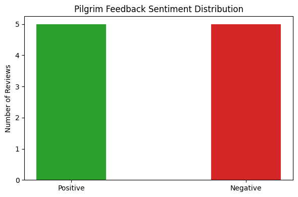

# 🕋 Pilgrim Sentiment & Feedback Analysis

An NLP-powered text classification project to evaluate pilgrim feedback across service touchpoints (transportation, smart gates, crowd flow, and facilities) to identify service bottlenecks and enhance visitor experience.

---

## 📌 Project Overview
- **Objective:** Classify visitor reviews into positive and negative sentiments to extract operational pain points.
- **Tech Stack:** Python, Scikit-learn, Pandas, Matplotlib.
- **NLP Pipeline:** TF-IDF Vectorization combined with Logistic Regression for text classification.

---

## 📊 Sentiment Distribution

---

## 💡 Practical Impact
- Automates the triage of customer complaints during high-density operations.
- Highlights recurring operational bottlenecks (e.g., shuttle delays, gate congestion) for immediate ground intervention.
